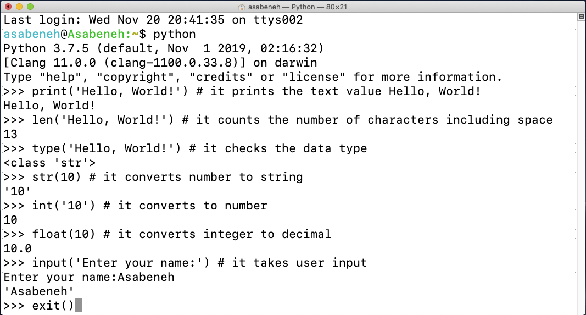

<div align="center">
  <h1> 30 Tage Python: Tag 2 - Variablen, Eingebaute Funktionen</h1>
  <a class="header-badge" target="_blank" href="https://www.linkedin.com/in/asabeneh/">
  
  </a>
  <a class="header-badge" target="_blank" href="https://twitter.com/Asabeneh">
  
  </a>

<sub>Autor:
<a href="https://www.linkedin.com/in/asabeneh/" target="_blank">Asabeneh Yetayeh</a><br>
<small> Zweite Edition: Juli 2021</small>
</sub>

</div>

[<< Tag 1](./README.md) | [Tag 3 >>](./03_operators_de.md)


- [📘 Tag 2](#-tag-2)
  - [Eingebaute Funktionen (Built-in functions)](#eingebaute-funktionen-built-in-functions)
  - [Variablen](#variablen)
    - [Mehrere Variablen in einer Zeile deklarieren](#mehrere-variablen-in-einer-zeile-deklarieren)
  - [Datentypen](#datentypen)
  - [Datentypen prüfen und Umwandlung (Casting)](#datentypen-prüfen-und-umwandlung-casting)
  - [Zahlen](#zahlen)
  - [💻 Übungen - Tag 2](#-übungen---tag-2)
    - [Übungen: Level 1](#übungen-level-1)
    - [Übungen: Level 2](#übungen-level-2)

# 📘 Tag 2

## Eingebaute Funktionen (Built-in functions)

In Python gibt es viele eingebaute Funktionen. Diese sind global verfügbar, was bedeutet, dass du sie nutzen kannst, ohne etwas zu importieren oder zu konfigurieren. Einige der am häufigsten verwendeten Funktionen sind: _print()_, _len()_, _type()_, _int()_, _float()_, _str()_, _input()_, _list()_, _dict()_, _min()_, _max()_, _sum()_, _sorted()_, _open()_, _help()_ und _dir()_. Eine vollständige Liste findest du in der [Python-Dokumentation](https://docs.python.org/3/library/functions.html).


Lass uns die Python-Shell öffnen und einige dieser Funktionen ausprobieren.



Probieren wir weitere Funktionen aus:


Wie du im Terminal sehen kannst, hat Python reservierte Wörter (Keywords). Wir verwenden diese nicht als Namen für Variablen oder Funktionen.


## Variablen

Variablen speichern Daten im Computerspeicher. Es wird empfohlen, aussagekräftige Namen (mnemonische Variablen) zu verwenden, die leicht zu merken sind. Eine Variable verweist auf eine Speicheradresse, an der die Daten abgelegt sind.

Regeln für Variablennamen in Python:
- Ein Variablenname muss mit einem Buchstaben oder einem Unterstrich (_) beginnen.
- Er darf nicht mit einer Zahl beginnen.
- Er darf nur alphanumerische Zeichen und Unterstriche enthalten (A-z, 0-9 und _).
- Variablennamen sind fallsensitiv (`firstname`, `Firstname`, `FirstName` und `FIRSTNAME` sind unterschiedliche Variablen).

Gültige Variablennamen:
```shell
firstname
lastname
age
country
first_name
last_name
_if # Wenn wir ein reserviertes Wort verwenden müssen
year_2021
num1
```

Ungültige Variablennamen:
```shell
first-name # Bindestrich nicht erlaubt
first@name # Sonderzeichen nicht erlaubt
1num       # Beginnt mit einer Zahl
```

In Python verwenden wir den **snake_case**. Das bedeutet, wir nutzen Unterstriche, um Wörter zu trennen (z.B. `first_name`, `last_name`).

Das Zuweisen eines Wertes zu einer Variable nennt man Deklaration. Das Gleichheitszeichen (=) ist der Zuweisungsoperator.

**Beispiel:**
```python
# Variablen in Python
first_name = 'Asabeneh'
last_name = 'Yetayeh'
country = 'Finnland'
city = 'Helsinki'
age = 250
is_married = True
skills = ['HTML', 'CSS', 'JS', 'React', 'Python']
person_info = {
   'firstname':'Asabeneh',
   'lastname':'Yetayeh',
   'country':'Finnland',
   'city':'Helsinki'
   }
```

Die Funktion `print()` kann eine unbegrenzte Anzahl von Argumenten entgegennehmen. Ein Argument ist ein Wert, den wir der Funktion übergeben.

**Beispiel:**
```python
print('Hallo, Welt!') # 'Hallo, Welt!' ist ein Argument
print('Hallo', ',', 'Welt', '!') # Vier Argumente übergeben
print(len('Hallo, Welt!')) # len() nimmt nur ein Argument
```

### Mehrere Variablen in einer Zeile deklarieren

Du kannst mehrere Variablen gleichzeitig deklarieren:

**Beispiel:**
```python
first_name, last_name, country, age, is_married = 'Asabeneh', 'Yetayeh', 'Finnland', 250, True

print(first_name, last_name, country, age, is_married)
```

Benutzereingaben mit `input()` abfragen:
```python
name = input('Wie heißt du? ')
alter = input('Wie alt bist du? ')

print(name)
print(alter)
```

## Datentypen prüfen und Umwandlung (Casting)

- **Datentypen prüfen:** Nutze `type()`.
```python
print(type('Asabeneh'))  # <class 'str'>
print(type(10))          # <class 'int'>
print(type(3.14))        # <class 'float'>
```

- **Casting:** Umwandlung eines Typs in einen anderen mit `int()`, `float()`, `str()`, `list()`, `set()`.
  Bei Berechnungen müssen Zahlen in Strings erst konvertiert werden.

**Beispiele:**
```python
# int zu float
num_int = 10
num_float = float(num_int) # 10.0

# float zu int
gravity = 9.81
print(int(gravity)) # 9

# int zu str
num_str = str(10) # '10'

# str zu list
name = 'Python'
print(list(name)) # ['P', 'y', 't', 'h', 'o', 'n']
```

## Zahlen

In Python gibt es drei Haupttypen von Zahlen:
1. **Integers:** Ganze Zahlen (positiv, negativ, Null).
2. **Floating Point (Float):** Dezimalzahlen (z.B. 9.81, -2.5).
3. **Complex:** Komplexe Zahlen (z.B. 1 + j).

---

## 💻 Übungen - Tag 2

### Übungen: Level 1
1. Erstelle im Ordner `30DaysOfPython` einen Unterordner `day_2` und darin eine Datei `variables.py`.
2. Füge einen Kommentar hinzu: 'Tag 2: 30 Tage Python Programmierung'.
3. Deklariere Variablen für Vorname, Nachname, vollständiger Name, Land, Stadt, Alter, Jahr, `is_married`, `is_true`, `is_light_on`.
4. Deklariere mehrere Variablen in einer Zeile.

### Übungen: Level 2
1. Überprüfe den Datentyp all deiner Variablen mit `type()`.
2. Ermittle die Länge deines Vornamens mit `len()`.
3. Vergleiche die Länge deines Vornamens mit der deines Nachnamens.
4. Deklariere 5 als `num_one` und 4 als `num_two`.
   - Berechne Summe, Differenz, Produkt, Division, Rest (Modulo), Potenz und Ganzzahl-Division.
5. Ein Kreis hat einen Radius von 30 Metern.
   - Berechne die Fläche (`area_of_circle`).
   - Berechne den Umfang (`circum_of_circle`).
   - Nimm den Radius als Benutzereingabe (`input`) und berechne die Fläche.
6. Nutze `input()`, um Vorname, Nachname, Land und Alter abzufragen.
7. Führe `help('keywords')` aus, um die reservierten Wörter in Python zu sehen.

🎉 HERZLICHEN GLÜCKWUNSCH! 🎉

[<< Tag 1](./README.md) | [Tag 3 >>](./03_operators_de.md)
