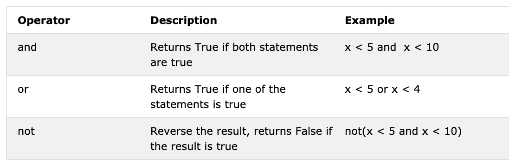

<div align="center">
  <h1> 30 Tage Python: Tag 3 - Operatoren</h1>
  <a class="header-badge" target="_blank" href="https://www.linkedin.com/in/asabeneh/">
  
  </a>
  <a class="header-badge" target="_blank" href="https://twitter.com/Asabeneh">
  
  </a>

<sub>Autor:
<a href="https://www.linkedin.com/in/asabeneh/" target="_blank">Asabeneh Yetayeh</a><br>
<small> Zweite Edition: Juli 2021</small>
</sub>
</div>

[<< Tag 2](./02_variables_builtin_functions_de.md) | [Tag 4 >>](./04_strings_de.md)


- [📘 Tag 3](#-tag-3)
  - [Boolean (Wahrheitswerte)](#boolean-wahrheitswerte)
  - [Operatoren](#operatoren)
    - [Zuweisungsoperatoren](#zuweisungsoperatoren)
    - [Arithmetische Operatoren](#arithmetische-operatoren)
    - [Vergleichsoperatoren](#vergleichsoperatoren)
    - [Logische Operatoren](#logische-operatoren)
  - [💻 Übungen - Tag 3](#-übungen---tag-3)

# 📘 Tag 3

## Boolean (Wahrheitswerte)

Ein Boolean-Datentyp repräsentiert einen von zwei Werten: _True_ (Wahr) oder _False_ (Falsch). Diese Datentypen werden besonders wichtig, wenn wir Vergleichsoperatoren nutzen. Beachte, dass in Python der erste Buchstabe immer großgeschrieben werden muss (**T**rue, **F**alse), anders als zum Beispiel in JavaScript.

**Beispiel: Boolean-Werte**
```python
print(True)
print(False)
```

## Operatoren

Python unterstützt verschiedene Arten von Operatoren. In diesem Abschnitt konzentrieren wir uns auf die wichtigsten.

### Zuweisungsoperatoren

Zuweisungsoperatoren werden verwendet, um Variablen Werte zuzuweisen. Das bekannteste Beispiel ist das Gleichheitszeichen (=). Während es in der Mathematik zeigt, dass zwei Werte gleich sind, bedeutet es in Python, dass wir einen Wert in einer Variablen speichern.


### Arithmetische Operatoren:

- **Addition (+):** `a + b`
- **Subtraktion (-):** `a - b`
- **Multiplikation (*):** `a * b`
- **Division (/):** `a / b` (Ergibt immer eine Fließkommazahl)
- **Modulo (%):** `a % b` (Ergibt den Rest der Division)
- **Ganzzahl-Division (//):** `a // b` (Entfernt den Rest nach dem Komma)
- **Potenzierung (**):** `a ** b` (a hoch b)


**Beispiel: Ganze Zahlen (Integers)**
```python
# Arithmetische Operationen in Python
print('Addition: ', 1 + 2)        # 3
print('Subtraktion: ', 2 - 1)     # 1
print('Multiplikation: ', 2 * 3)  # 6
print('Division: ', 4 / 2)       # 2.0 (Division ergibt immer einen Float)
print('Ganzzahl-Division: ', 7 // 2)   # 3 (Gibt das Ergebnis ohne Rest zurück)
print('Modulo: ', 3 % 2)         # 1 (Gibt den Rest zurück)
print('Potenzierung: ', 2 ** 3) # 8 (2 * 2 * 2)
```

### Vergleichsoperatoren

In der Programmierung vergleichen wir ständig Werte. Wir prüfen, ob ein Wert größer, kleiner oder gleich einem anderen Wert ist.


**Beispiel: Vergleichsoperatoren**
```python
print(3 > 2)     # True, da 3 größer als 2 ist
print(3 == 2)    # False, da 3 nicht gleich 2 ist
print(len('mango') == len('avocado'))  # False
print('python' > 'dragon')   # False
```

Zusätzlich zu den Standards nutzt Python:
- _is_: Gibt True zurück, wenn beide Variablen dasselbe Objekt sind.
- _is not_: Gibt True zurück, wenn sie nicht dasselbe Objekt sind.
- _in_: Gibt True zurück, wenn ein Element in einer Liste/String enthalten ist.
- _not in_: Gibt True zurück, wenn ein Element nicht enthalten ist.

### Logische Operatoren

Anders als viele andere Sprachen nutzt Python die Wörter _and_, _or_ und _not_ als logische Operatoren.



```python
print(3 > 2 and 4 > 3) # True - beide Aussagen sind wahr
print(3 > 2 or 4 < 3)  # True - eine der Aussagen ist wahr
print(not 3 > 2)       # False - Verneinung von True ergibt False
```

---

## 💻 Übungen - Tag 3

1. Deklariere dein Alter als Integer-Variable.
2. Deklariere deine Größe als Float-Variable.
3. Deklariere eine Variable für eine komplexe Zahl.
4. Berechne die Fläche eines Dreiecks (Fläche = 0.5 * Basis * Höhe). Frage den Benutzer nach Basis und Höhe.
5. Berechne den Umfang eines Dreiecks (Umfang = a + b + c).
6. Berechne Fläche und Umfang eines Rechtecks (Länge und Breite per `input`).
7. Berechne Fläche und Umfang eines Kreises (Radius per `input`, pi = 3.14).
8. Berechne Steigung, x-Schnittpunkt und y-Schnittpunkt von `y = 2x - 2`.
9. Berechne die Steigung und den [Euklidischen Abstand](https://de.wikipedia.org/wiki/Euklidischer_Abstand) zwischen Punkt (2, 2) und Punkt (6, 10).
10. Vergleiche die Steigungen aus Aufgabe 8 und 9.
11. Berechne den Wert von y (`y = x^2 + 6x + 9`). Probiere verschiedene x-Werte aus, um zu sehen, wann y Null wird.
12. Finde die Länge von 'python' und 'dragon' und erstelle eine falsche Vergleichsaussage.
13. Prüfe mit `and`, ob 'on' sowohl in 'python' als auch in 'dragon' vorkommt.
14. Prüfe mit `in`, ob das Wort 'jargon' im Satz "I hope this course is not full of jargon" vorkommt.
15. Prüfe, ob 'on' nicht in 'dragon' und 'python' vorkommt.
16. Ermittle die Länge von 'python', wandle den Wert in einen Float und dann in einen String um.
17. Wie prüft man mit Python, ob eine Zahl gerade ist (durch 2 teilbar)?
18. Prüfe, ob die Ganzzahl-Division von 7 durch 3 gleich dem Integer-Wert von 2.7 ist.
19. Prüfe, ob der Typ von '10' gleich dem Typ von 10 ist.
20. Prüfe, ob `int('9.8')` gleich 10 ist (Hinweis: Du musst eventuell erst in Float umwandeln).
21. Berechne den Wochenlohn (Stunden * Stundensatz per `input`).
22. Berechne die gelebten Sekunden eines Menschen basierend auf seinen Lebensjahren (per `input`).
23. Schreibe ein Skript, das folgende Tabelle ausgibt:
```
1 1 1 1 1
2 1 2 4 8
3 1 3 9 27
4 1 4 16 64
5 1 5 25 125
```

🎉 HERZLICHEN GLÜCKWUNSCH! 🎉

[<< Tag 2](./02_variables_builtin_functions_de.md) | [Tag 4 >>](./04_strings_de.md)
