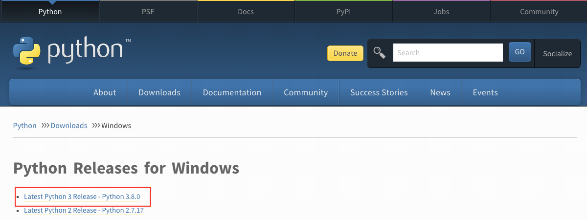
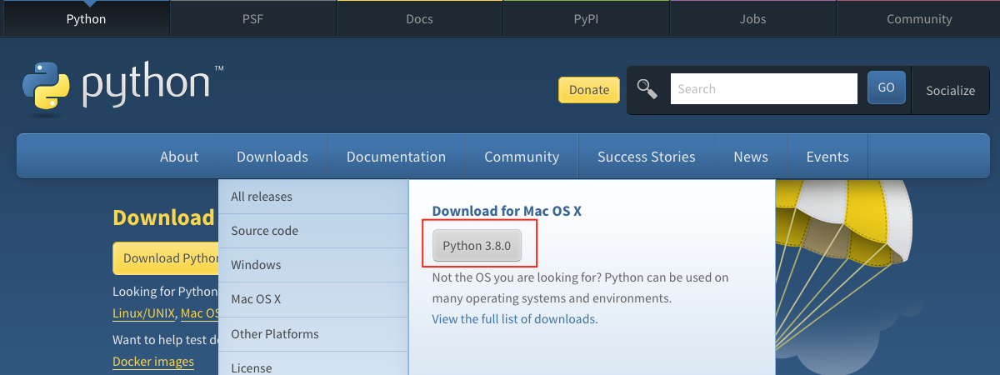
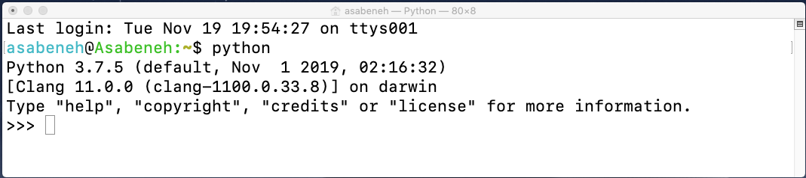
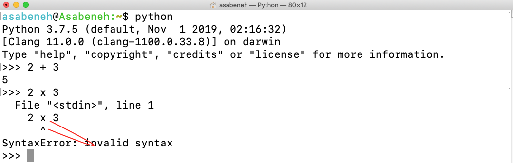
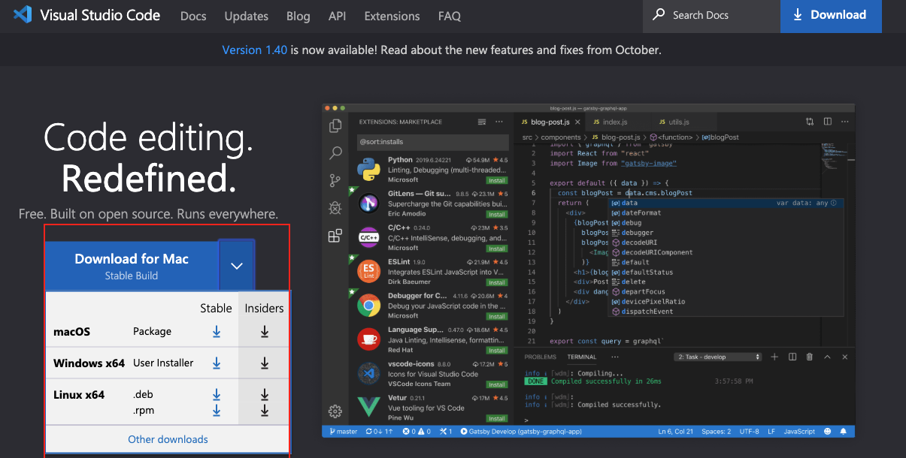
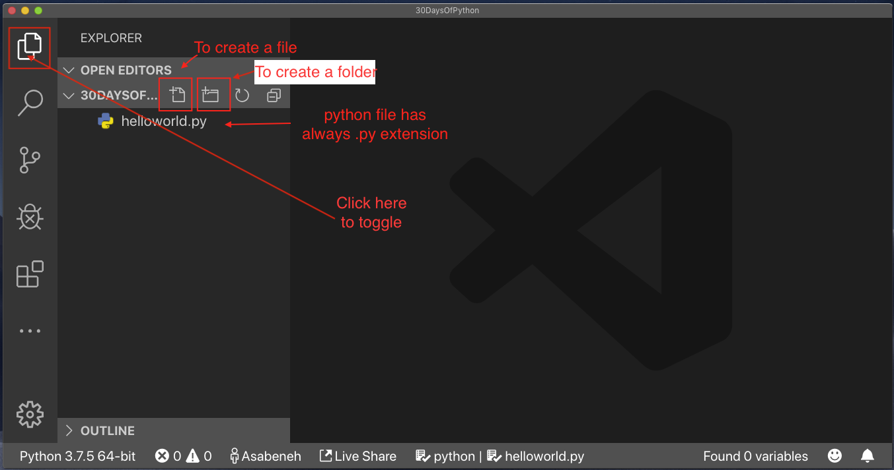
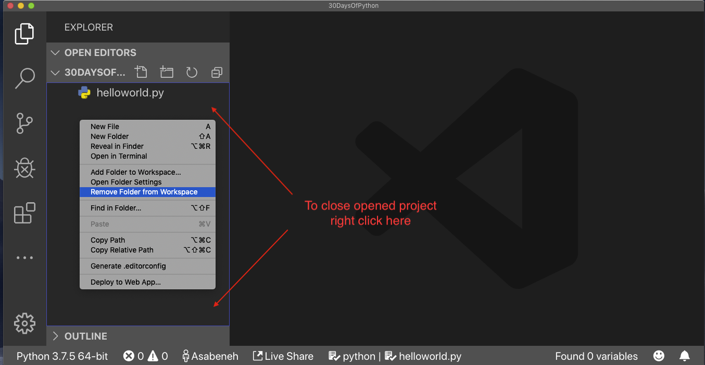
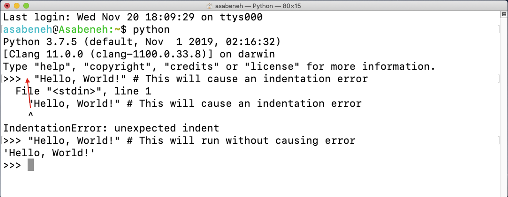

# 🐍 ۳۰ روز پایتون

|\# روز | سرفصل‌ها |
|:---:|:---:|
| 01 | [مقدمه](./readme.md)|
| 02 | [متغیرها، توابع داخلی](./02_variables_builtin_functions.md)|
| 03 | [عملگرها](./03_operators.md)|
| 04 | [رشته‌ها](./04_strings.md)|
| 05 | [لیست‌ها](./05_lists.md)|
| 06 | [تاپل‌ها](./06_tuples.md)|
| 07 | [مجموعه‌ها](./07_sets.md)|
| 08 | [دیکشنری‌ها](./08_dictionaries.md)|
| 09 | [دستورات شرطی](./09_conditionals.md)|
| 10 | [حلقه‌ها](./10_loops.md)|
| 11 | [توابع](./11_functions.md)|
| 12 | [ماژول‌ها](./12_modules.md)|
| 13 | [List Comprehension](./13_list_comprehension.md)|
| 14 | [توابع مرتبه بالا](./14_higher_order_functions.md)|
| 15 | [خطاهای نوع در پایتون](./15_python_type_errors.md)|
| 16 | [تاریخ و زمان در پایتون](./16_python_datetime.md) |
| 17 | [مدیریت استثناءها](./17_exception_handling.md)|
| 18 | [عبارات باقاعده](./18_regular_expressions.md)|
| 19 | [کار با فایل‌ها](./19_file_handling.md)|
| 20 | [مدیر بسته پایتون](./20_python_package_manager.md)|
| 21 | [کلاس‌ها و اشیاء](./21_classes_and_objects.md)|
| 22 | [Web Scraping](./22_web_scraping.md)|
| 23 | [محیط مجازی](./23_virtual_environment.md)|
| 24 | [آمار](./24_statistics.md)|
| 25 | [Pandas](./25_pandas.md)|
| 26 | [وب در پایتون](./26_python_web.md)|
| 27 | [پایتون با MongoDB](./27_python_with_mongodb.md)|
| 28 | [API](./28_API.md)|
| 29 | [ساخت API](./29_building_API.md)|
| 30 | [نتیجه‌گیری](./30_conclusions.md)|

<small>🧡🧡🧡 کدنویسی خوشحال 🧡🧡🧡</small>

### 🙌 تبدیل شدن به حامی مالی

می‌توانید با تبدیل شدن به حامی در **[GitHub Sponsors](https://github.com/sponsors/asabeneh)** یا از طریق [PayPal](https://www.paypal.me/asabeneh) از این پروژه حمایت کنید.

هرگونه حمایت، چه کوچک چه بزرگ، تاثیر زیادی دارد. از حمایت شما سپاسگزاریم! 🌟

---

<div align="center">
  <h1> ۳۰ روز با پایتون: روز ۱ - مقدمه</h1>
  <a class="header-badge" target="_blank" href="https://www.linkedin.com/in/asabeneh/">
  
  </a>
  <a class="header-badge" target="_blank" href="https://twitter.com/Asabeneh">
  
  </a>

  <sub>نویسنده:
  <a href="https://www.linkedin.com/in/asabeneh/" target="_blank">Asabeneh Yetayeh</a><br>
  <small> ویرایش دوم: جولای ۲۰۲۱</small>
  </sub>
</div>

🇬🇧 [English](../README.md)
🇧🇷 [Portuguese](../Portuguese/README.md)
🇨🇳 [中文](../Chinese/README.md)


[روز ۲ \>\>](./02_variables_builtin_functions.md)

- [🐍 ۳۰ روز پایتون](#-۳۰-روز-پایتون)
- [📘 روز ۱](#-روز-۱)
  - [خوش‌آمدید](#خوشآمدید)
  - [مقدمه](#مقدمه)
  - [چرا پایتون؟](#چرا-پایتون)
  - [آماده‌سازی محیط](#آمادهسازی-محیط)
    - [نصب پایتون](#نصب-پایتون)
    - [شل پایتون](#شل-پایتون)
    - [نصب ویژوال استودیو کد](#نصب-ویژوال-استودیو-کد)
      - [چگونه از ویژوال استودیو کد استفاده کنیم](#چگونه-از-ویژوال-استودیو-کد-استفاده-کنیم)
  - [مبانی پایتون](#مبانی-پایتون)
    - [سینتکس پایتون](#سینتکس-پایتون)
    - [تورفتگی در پایتون](#تورفتگی-در-پایتون)
    - [کامنت‌ها](#کامنتها)
    - [انواع داده](#انواع-داده)
      - [عدد](#عدد)
      - [رشته](#رشته-string)
      - [بولین](#بولین-booleans)
      - [لیست](#لیست-list)
      - [دیکشنری](#دیکشنری-dictionary)
      - [تاپل](#تاپل-tuple)
      - [مجموعه](#مجموعه-set)
    - [بررسی انواع داده](#بررسی-انواع-داده)
    - [فایل پایتون](#فایل-پایتون)
  - [💻 تمرینات - روز ۱](#-تمرینات---روز-۱)
    - [تمرین: سطح ۱](#تمرین-سطح-۱)
    - [تمرین: سطح ۲](#تمرین-سطح-۲)
    - [تمرین: سطح ۳](#تمرین-سطح-۳)

# 📘 روز ۱

## خوش‌آمدید

**تبریک** می‌گویم که تصمیم گرفتید در چالش برنامه‌نویسی *۳۰ روز پایتون* شرکت کنید. در این چالش، شما هر آنچه را که برای تبدیل شدن به یک برنامه‌نویس پایتون نیاز دارید و کل مفهوم برنامه‌نویسی را یاد خواهید گرفت. در پایان چالش، گواهی‌نامه چالش برنامه‌نویسی *30DaysOfPython* را دریافت خواهید کرد.

اگر می‌خواهید به طور فعال در این چالش شرکت کنید، می‌توانید به گروه تلگرام [چالش 30DaysOfPython](https://t.me/ThirtyDaysOfPython) بپیوندید.

## مقدمه

پایتون یک زبان برنامه‌نویسی سطح بالا برای برنامه‌نویسی همه‌منظوره است. این یک زبان برنامه‌نویسی متن‌باز، مفسری و شیءگرا است. پایتون توسط یک برنامه‌نویس هلندی به نام Guido van Rossum ساخته شد. نام زبان برنامه‌نویسی پایتون از یک مجموعه کمدی بریتانیایی به نام *Monty Python's Flying Circus* گرفته شده است. اولین نسخه آن در ۲۰ فوریه ۱۹۹۱ منتشر شد. این چالش ۳۰ روزه پایتون به شما کمک می‌کند تا آخرین نسخه پایتون، یعنی پایتون ۳ را قدم به قدم یاد بگیرید. مباحث به ۳۰ روز تقسیم شده‌اند، که هر روز شامل چندین موضوع با توضیحات قابل فهم، مثال‌های واقعی و تمرینات و پروژه‌های عملی فراوان است.

این چالش برای مبتدیان و حرفه‌ای‌هایی طراحی شده است که می‌خواهند زبان برنامه‌نویسی پایتون را یاد بگیرند. تکمیل این چالش ممکن است ۳۰ تا ۱۰۰ روز طول بکشد. افرادی که به طور فعال در گروه تلگرام شرکت می‌کنند، احتمال بالایی برای تکمیل چالش دارند.

این چالش خوانا، به زبان انگلیسی محاوره‌ای نوشته شده، جذاب، انگیزه‌بخش و در عین حال بسیار پرچالش است. برای به پایان رساندن این چالش نیاز به تخصیص زمان زیادی دارید. اگر یادگیرنده بصری هستید، می‌توانید درس‌های ویدیویی را در کانال یوتیوب \<a href="https://www.youtube.com/channel/UC7PNRuno1rzYPb1xLa4yktw"\>Washera\</a\> مشاهده کنید. می‌توانید از ویدیوی [پایتون برای مبتدیان مطلق](https://youtu.be/OCCWZheOesI) شروع کنید. کانال را سابسکرایب کنید، در ویدیوهای یوتیوب کامنت بگذارید و سوال بپرسید و فعال باشید، نویسنده در نهایت متوجه شما خواهد شد.

نویسنده دوست دارد نظر شما را درباره چالش بداند، با بیان افکارتان در مورد چالش 30DaysOfPython، نظر خود را با نویسنده به اشتراک بگذارید. می‌توانید نظرات خود را در این [لینک](https://www.asabeneh.com/testimonials) ثبت کنید.
## چرا پایتون؟

پایتون زبانی است که ساختار آن به زبان انسان نزدیک است؛ به همین دلیل یادگیری و استفاده از آن ساده‌تر از بسیاری از زبان‌های برنامه‌نویسی دیگر است.

این زبان در صنایع و شرکت‌های بزرگ، از جمله گوگل، کاربرد گسترده‌ای دارد. از پایتون برای توسعه برنامه‌های وب و دسکتاپ، مدیریت سیستم‌ها و همچنین ایجاد کتابخانه‌های مرتبط با یادگیری ماشین استفاده می‌شود. افزون بر این، در حوزه‌های علم داده و یادگیری ماشین نیز جایگاه ویژه‌ای پیدا کرده و به‌طور گسترده مورد استفاده قرار می‌گیرد.

امیدوارم این دلایل شما را به شروع یادگیری پایتون ترغیب کند. پایتون در حال تسخیر جهان است و شما قبل از اینکه شما را تسخیر کند، آن را از پا در می‌آورید.## آماده‌سازی محیط

### نصب پایتون

برای اجرای یک اسکریپت پایتون، باید پایتون را نصب کنید. بیایید پایتون را [دانلود](https://www.python.org/) کنیم.
اگر کاربر ویندوز هستید، روی دکمه‌ای که با رنگ قرمز مشخص شده کلیک کنید.

[](https://www.python.org/)

اگر کاربر macOS هستید، روی دکمه‌ای که با رنگ قرمز مشخص شده کلیک کنید.

[](https://www.python.org/)

برای بررسی اینکه آیا پایتون نصب شده است، دستور زیر را در ترمینال دستگاه خود بنویسید.

```shell
python --version
```


همانطور که از ترمینال می‌بینید، من در حال حاضر از نسخه *پایتون ۳.۷.۵* استفاده می‌کنم. نسخه پایتون شما ممکن است با نسخه من متفاوت باشد اما باید ۳.۶ یا بالاتر باشد. اگر موفق به دیدن نسخه پایتون شدید، آفرین. پایتون بر روی دستگاه شما نصب شده است. به بخش بعدی بروید.

### شل پایتون

پایتون یک زبان اسکریپت‌نویسی مفسری است؛ بنابراین برای اجرای برنامه‌ها نیازی به کامپایل ندارد. در این زبان، کدها به‌صورت خط‌به‌خط اجرا می‌شوند.

پایتون همراه با یک محیط تعاملی به نام «شل پایتون» ارائه می‌شود. این محیط به شما امکان می‌دهد دستورات را به‌صورت مستقیم اجرا کرده و نتیجه را همان‌جا مشاهده کنید.

شل پایتون منتظر دریافت دستورات از سوی کاربر است. به‌محض وارد کردن کد، آن را تفسیر کرده و خروجی را در خط بعدی نمایش می‌دهد.

برای شروع، ترمینال یا Command Prompt (cmd) را باز کرده و دستور زیر را وارد کنید:

```shell
python
```


شل تعاملی پایتون باز شده و اکنون منتظر است تا شما کد پایتون (اسکریپت) خود را وارد کنید. کافی است کدتان را در کنار نماد `<<<` بنویسید و سپس کلید Enter را فشار دهید.

حالا بیایید اولین اسکریپت پایتون خود را در این محیط بنویسیم.


خوب انجام دادید! شما اولین اسکریپت پایتون خود را در شل تعاملی اجرا کردید. اما چگونه می‌توان این شل را بست؟

برای خروج از شل تعاملی، در کنار نماد `<<<` دستور `exit()` را تایپ کنید و Enter بزنید.


در این مرحله، شما یاد گرفته‌اید چگونه شل تعاملی پایتون را اجرا کنید و چگونه از آن خارج شوید.

پایتون زمانی نتیجه را به شما نشان می‌دهد که اسکریپتی بنویسید که برایش قابل‌فهم باشد؛ در غیر این صورت، پیام خطا نمایش می‌دهد. حالا بیایید عمداً یک اشتباه انجام دهیم تا ببینیم پایتون چه پاسخی می‌دهد.



همانطور که از خطای بازگشتی می‌بینید، پایتون آنقدر هوشمند است که اشتباهی را که ما مرتکب شدیم و آن *Syntax Error: invalid syntax* بود را می‌شناسد. استفاده از  (**x**)  برای ضرب در پایتون یک خطای سینتکس است زیرا (x) یک سینتکس معتبر در پایتون نیست. به جای (**x**) ما از ستاره (\*) برای ضرب استفاده می‌کنیم. خطای بازگشتی به وضوح نشان می‌دهد که چه چیزی را باید اصلاح کرد.

فرآیند شناسایی و حذف خطاها از یک برنامه، *دیباگینگ* (_debugging_) نامیده می‌شود. بیایید با قرار دادن \* به جای **x** آن را دیباگ کنیم.

باگ (bug) یا اشکال برطرف شد، کد به‌درستی اجرا شد و به نتیجه مورد انتظار رسیدیم. به‌عنوان یک برنامه‌نویس، به‌طور روزمره با چنین خطاهایی روبه‌رو خواهید شد؛ بنابراین آشنایی با روش‌های دیباگ کردن اهمیت زیادی دارد.

برای اینکه در دیباگ کردن مهارت پیدا کنید، ابتدا باید انواع خطاهایی را که ممکن است با آن‌ها مواجه شوید بشناسید. برخی از خطاهای رایج در پایتون عبارت‌اند از:
- *SyntaxError*
- *IndexError*
- *NameError*
- *ModuleNotFoundError*
- *KeyError*
- *ImportError*
- *AttributeError*
- *TypeError*
- *ValueError*
- *ZeroDivisionError*

 و غیره که در بخش‌های بعدی درباره انواع مختلف ***خطاهای*** پایتون بیشتر صحبت خواهیم کرد.

برای تسلط بیشتر بر استفاده از شل تعاملی پایتون، بهتر است کمی تمرین کنید. ترمینال یا Command Prompt سیستم خود را باز کنید و دستور **python** را وارد کنید.

شل تعاملی پایتون اکنون اجرا شده است. بیایید چند عملگر ریاضی پایه را در آن امتحان کنیم؛ مانند جمع، تفریق، ضرب، تقسیم، باقیمانده و توان.

 پیش از نوشتن کد پایتون، ابتدا کمی با محاسبات ریاضی تمرین کنیم:

- 2 + 3 = 5
- 3 - 2 = 1
- 3 \* 2 = 6
- 3 / 2 = 1.5
- 3 \*\* 2 = 3 x 3 = 9

در پایتون ما عملیات اضافی زیر را هم داریم:

  - ۳ % ۲ = ۱ =\> که به معنای یافتن باقیمانده است
  - ۳ // ۲ = ۱ =\> که به معنای حذف باقیمانده است

بیایید عبارات ریاضی بالا را به کد پایتون تبدیل کنیم. اکنون که شل پایتون باز است، بهتر است در ابتدای کار یک کامنت بنویسیم.

_کامنت_ بخشی از کد است که توسط پایتون اجرا نمی‌شود. از کامنت‌ها برای توضیح دادن کد و افزایش خوانایی آن استفاده می‌کنیم. پایتون این بخش‌ها را نادیده می‌گیرد. در پایتون، کامنت با نماد هشتگ (`#`) آغاز می‌شود.

نمونه‌ای از نوشتن کامنت در پایتون:

```shell
# کامنت با هشتگ شروع می‌شود
# این یک کامنت پایتون است، چون با نماد (#) شروع شده است
```


پیش از آنکه به بخش بعدی برویم، کمی بیشتر با شل تعاملی پایتون تمرین کنیم. شل بازشده را با نوشتن `exit()` ببندید، سپس دوباره آن را اجرا کنید و تمرین کنید که چگونه متن را در شل پایتون وارد کنید.


### نصب ویژوال استودیو کد

شل تعاملی پایتون برای امتحان و تست کدهای اسکریپت کوچک خوب است اما برای یک پروژه بزرگ مناسب نخواهد بود. در محیط کار واقعی، توسعه‌دهندگان از ویرایشگرهای کد مختلفی برای نوشتن کد استفاده می‌کنند. در این چالش ۳۰ روزه برنامه‌نویسی پایتون، ما از ویژوال استودیو کد استفاده خواهیم کرد. ویژوال استودیو کد یک ویرایشگر متن متن‌باز بسیار محبوب است. من از طرفداران vscode هستم و توصیه می‌کنم ویژوال استودیو کد را [دانلود](https://code.visualstudio.com/) کنید، اما اگر طرفدار ویرایشگرهای دیگر هستید، با هر چیزی که دارید ادامه دهید.



اگر ویژوال استودیو کد را نصب کرده‌اید، بیایید ببینیم چگونه از آن استفاده کنیم.
اگر ویدیو را ترجیح می‌دهید، می‌توانید این [آموزش ویدیویی ویژوال استودیو کد برای پایتون](https://www.youtube.com/watch?v=bn7Cx4z-vSo) را دنبال کنید.

#### چگونه از ویژوال استودیو کد استفاده کنیم

ویژوال استودیو کد را با دوبار کلیک کردن روی آیکون آن باز کنید. وقتی آن را باز می‌کنید، با چنین رابط کاربری مواجه خواهید شد. سعی کنید با آیکون‌های خط کشیده شده تعامل داشته باشید.


یک پوشه به نام 30DaysOfPython روی دسکتاپ خود ایجاد کنید. سپس آن را با استفاده از ویژوال استودیو کد باز کنید.


پس از باز کردن آن، میانبرهایی برای ایجاد فایل‌ها و پوشه‌ها در داخل دایرکتوری پروژه 30DaysOfPython خواهید دید. همانطور که در زیر می‌بینید، من اولین فایل به نام helloworld.py را ایجاد کرده‌ام. شما هم می‌توانید همین کار را انجام دهید.

پس از یک روز طولانی کدنویسی، می‌خواهید ویرایشگر کد خود را ببندید، درست است؟ اینگونه پروژه باز شده را خواهید بست.

تبریک می‌گویم، شما آماده‌سازی محیط توسعه را به پایان رساندید. بیایید کدنویسی را شروع کنیم.

## مبانی پایتون

### سینتکس پایتون

یک اسکریپت پایتون می‌تواند در شل تعاملی پایتون یا در ویرایشگر کد نوشته شود. یک فایل پایتون پسوند .py دارد.

### تورفتگی در پایتون

تورفتگی (Indentation) یک فضای خالی در متن است. تورفتگی در بسیاری از زبان‌ها برای افزایش خوانایی کد استفاده می‌شود؛ با این حال، پایتون از تورفتگی برای ایجاد بلوک‌های کد استفاده می‌کند. در زبان‌های برنامه‌نویسی دیگر، برای ایجاد بلوک‌های کد به جای تورفتگی از آکولاد استفاده می‌شود. یکی از باگ‌های رایج هنگام نوشتن کد پایتون، تورفتگی نادرست است.

### کامنت‌ها

کامنت‌ها نقش مهمی در افزایش خوانایی کد دارند و به توسعه‌دهندگان اجازه می‌دهند یادداشت‌هایی را در کد خود بگذارند. در پایتون، هر متنی که قبل از آن نماد هشتگ (\#) آمده باشد، به عنوان کامنت در نظر گرفته می‌شود و هنگام اجرای کد، اجرا نمی‌شود.

**مثال: کامنت تک خطی**

```shell
    # این اولین کامنت است
    # این دومین کامنت است
    # پایتون در حال تسخیر جهان است
```

**مثال: کامنت چند خطی**

اگر به یک متغیر اختصاص داده نشود، می‌توان از سه کوتیشن برای کامنت چند خطی استفاده کرد.

```shell
"""این یک کامنت چند خطی است
کامنت چند خطی چندین خط را در بر می‌گیرد.
پایتون در حال تسخیر جهان است
"""
```

### انواع داده

در پایتون، انواع مختلفی از داده‌ها وجود دارد. در اینجا با رایج‌ترین آن‌ها آشنا می‌شویم. هر یک از این انواع داده در بخش‌های بعدی به‌صورت مفصل بررسی خواهد شد، اما در این مرحله هدف فقط آشنایی اولیه با آن‌هاست. بنابراین، لازم نیست اکنون درک کاملی از همه‌ی آن‌ها داشته باشید.

#### عدد

  - صحیح (Integer): اعداد صحیح (منفی، صفر و مثبت)
    مثال:
    ... -۳، -۲، -۱، ۰، ۱، ۲، ۳ ...
  - اعشاری (Float): عدد اعشاری
    مثال
    ... -۳.۵، -۲.۲۵، -۱.۰، ۰.۰، ۱.۱، ۲.۲، ۳.۵ ...
  - مختلط (Complex)
    مثال
    1 + j، 2 + 4j

#### رشته (String)

رشته (String) مجموعه‌ای از یک یا چند کاراکتر است که داخل کوتیشن تکی (' ') یا دوتایی (" ") قرار می‌گیرد. اگر طول رشته بیشتر باشد و شامل چند جمله شود، معمولاً از سه کوتیشن (''' ''' یا """ """) برای تعریف آن استفاده می‌کنیم.

**مثال:**

```py
'Asabeneh'
'Finland'
'Python'
'I love teaching'
'I hope you are enjoying the first day of 30DaysOfPython Challenge'
```

#### بولین (Booleans)

یک نوع داده بولین یا مقدار `True` است یا `False`. T و F همیشه باید با حرف بزرگ باشند.

**مثال:**

```python
True  # آیا چراغ روشن است؟ اگر روشن باشد، مقدار True است
False # آیا چراغ روشن است؟ اگر خاموش باشد، مقدار False است
```

#### لیست (List)

لیست پایتون یک مجموعه مرتب است که اجازه می‌دهد آیتم‌هایی از انواع داده مختلف را ذخیره کند. یک لیست شبیه به یک آرایه در جاوا اسکریپت است.

**مثال:**

```py
[0, 1, 2, 3, 4, 5]  # همه از یک نوع داده هستند - لیستی از اعداد
['Banana', 'Orange', 'Mango', 'Avocado'] # همه از یک نوع داده هستند - لیستی از رشته‌ها (میوه‌ها)
['Finland','Estonia', 'Sweden','Norway'] # همه از یک نوع داده هستند - لیستی از رشته‌ها (کشورها)
['Banana', 10, False, 9.81] # انواع داده مختلف در لیست - رشته، عدد صحیح، بولین و اعشاری
```

#### دیکشنری (Dictionary)

یک شیء دیکشنری پایتون، مجموعه‌ای نامرتب از داده‌ها در قالب زوج کلید-مقدار است.

**مثال:**

```py
{
'first_name':'Asabeneh',
'last_name':'Yetayeh',
'country':'Finland', 
'age':250, 
'is_married':True,
'skills':['JS', 'React', 'Node', 'Python']
}
```

#### تاپل (Tuple)

تاپل یک مجموعه مرتب از انواع داده‌های مختلف مانند لیست است اما تاپل‌ها پس از ایجاد قابل تغییر نیستند. آنها غیرقابل تغییر (immutable) هستند.

**مثال:**

```py
('Asabeneh', 'Pawel', 'Brook', 'Abraham', 'Lidiya') # نام‌ها
```

```py
('Earth', 'Jupiter', 'Neptune', 'Mars', 'Venus', 'Saturn', 'Uranus', 'Mercury') # سیارات
```

#### مجموعه (Set)

مجموعه، یک گردآوری از انواع داده شبیه به لیست و تاپل است. برخلاف لیست و تاپل، مجموعه یک گردآوری مرتب از آیتم‌ها نیست. مانند ریاضیات، مجموعه در پایتون فقط آیتم‌های منحصر به فرد را ذخیره می‌کند.

در بخش‌های بعدی، به تفصیل در مورد هر یک از انواع داده‌های پایتون صحبت خواهیم کرد.

**مثال:**

```py
{2, 4, 3, 5}
{3.14, 9.81, 2.7} # ترتیب در مجموعه مهم نیست
```

### بررسی انواع داده

برای بررسی نوع داده یک داده/متغیر خاص، از تابع **type** استفاده می‌کنیم. در ترمینال زیر انواع داده‌های مختلف پایتون را مشاهده خواهید کرد:

### فایل پایتون


ابتدا پوشه‌ی پروژه‌ی خود با نام `30DaysOfPython` را باز کنید. اگر چنین پوشه‌ای ندارید، آن را ایجاد کنید. سپس داخل این پوشه، فایلی به نام `helloworld.py` بسازید.  

حالا می‌خواهیم همان کاری را که در شل تعاملی پایتون انجام دادیم، این‌بار در محیط ویژوال استودیو کد اجرا کنیم.

در شل تعاملی پایتون، خروجی بدون استفاده از **print** نمایش داده می‌شود؛ اما در ویژوال استودیو کد برای مشاهده‌ی نتیجه باید از تابع داخلی *print()* استفاده کنیم.  

تابع *print()* می‌تواند یک یا چند آرگومان را دریافت کند، مانند:  
`print('argument1', 'argument2', 'argument3')`

برای درک بهتر، به مثال‌های زیر توجه کنید.

**مثال:**

نام فایل helloworld.py است

```py
# روز ۱ - چالش 30DaysOfPython

print(2 + 3)             # جمع (+)
print(3 - 1)             # تفریق (-)
print(2 * 3)             # ضرب (*)
print(3 / 2)             # تقسیم (/)
print(3 ** 2)            # توان (**)
print(3 % 2)             # باقیمانده (%)
print(3 // 2)            # تقسیم صحیح (//)

# بررسی انواع داده
print(type(10))          # Int
print(type(3.14))        # Float
print(type(1 + 3j))      # Complex number
print(type('Asabeneh'))  # String
print(type([1, 2, 3]))   # List
print(type({'name':'Asabeneh'})) # Dictionary
print(type({9.8, 3.14, 2.7}))    # Set
print(type((9.8, 3.14, 2.7)))    # Tuple
```

برای اجرای فایل پایتون، به تصویر زیردقت کنید. شما می‌توانید فایل پایتون را با کلیک روی دکمه سبز در ویژوال استودیو کد یا با تایپ *python helloworld.py* در ترمینال اجرا کنید.


🌕 شما شگفت‌انگیز هستید. شما به تازگی چالش روز اول را به پایان رساندید و در مسیر بزرگی قرار دارید. اکنون چند تمرین برای مغز و عضلات خود انجام بدهید.

## 💻 تمرینات - روز ۱

### تمرین: سطح ۱

1.  نسخه پایتونی که استفاده می‌کنید را بررسی کنید.
2.  شل تعاملی پایتون را باز کرده و عملیات زیر را انجام دهید. عملوندها ۳ و ۴ هستند.
      - جمع (+)
      - تفریق (-)
      - ضرب (\*)
      - باقیمانده (%)
      - تقسیم (/)
      - توان (\*\*)
      - تقسیم صحیح (//)
3.  رشته‌های زیر را در شل تعاملی پایتون بنویسید:
      - نام شما
      - نام خانوادگی شما
      - کشور شما
      - من از ۳۰ روز پایتون لذت می‌برم
4.  نوع داده‌های زیر را بررسی کنید:
      - 10
      - 9.8
      - 3.14
      - 4 - 4j
      - ['Asabeneh', 'Python', 'Finland']
      - نام شما
      - نام خانوادگی شما
      - کشور شما

### تمرین: سطح ۲

1. یک پوشه با نام `day_1` در داخل پوشه‌ی `30DaysOfPython` ایجاد کنید. سپس درون پوشه‌ی `day_1`، یک فایل پایتون با نام `helloworld.py` بسازید. در این فایل، تمرین‌های ۱، ۲، ۳ و ۴ را دوباره انجام دهید.  به خاطر داشته باشید که هنگام کار با فایل‌های پایتون، برای نمایش خروجی باید از تابع print() استفاده کنید.  در پایان، به مسیری که فایل را در آن ذخیره کرده‌اید بروید و آن را اجرا کنید.

### تمرین: سطح ۳

1.  برای انواع داده‌های مختلف پایتون مانند عدد (صحیح، اعشاری، مختلط)، رشته، بولین، لیست، تاپل، مجموعه و دیکشنری یک مثال بنویسید.
2.  [فاصله اقلیدسی](https://en.wikipedia.org/wiki/Euclidean_distance) بین (۲, ۳) و (۱۰, ۸) را پیدا کنید.

🎉 تبریک می‌گویم\! 🎉

[روز ۲ \>\>](./02_variables_builtin_functions.md)